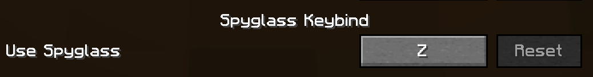

# Spyglass Keybind

Spyglass Keybind is a simple Minecraft mod that adds keybind (`Z` by default) for Spyglass quick access. Recommended to use along with [Spyglass Astronomy](https://modrinth.com/mod/spyglass-astronomy) for zooming functionality.




## Installation

This mod requires [Fabric](https://fabricmc.net/use/) and [Fabric API](https://modrinth.com/mod/fabric-api). You can download Spyglass Keybind from the [Modrinth](https://modrinth.com/mod/spyglass-keybind).
Drop the mod and Fabric API `jar` files inside the mods folder.

To enable Equipment Slot functionality you can use any of these options:
- [Accessories](https://modrinth.com/mod/accessories) (recommended)
- [Trinkets](https://modrinth.com/mod/trinkets)

## Building from source

### Unix

```sh
git clone https://github.com/daniewerg/spyglass-keybind/
cd spyglass-improvements
./gradlew clean build
```

### Windows

```shell script
git clone https://github.com/daniewerg/spyglass-keybind/
cd spyglass-improvements
gradlew build
```
You can find the built JARs inside `./spyglass-keybind/fabric/build/libs`, ignore `*-dev-shadow|*-sources` files.

## Credit

Forked from [Spyglass Improvements](https://github.com/juancarloscp52/spyglass-improvements), all original code except for the feature related to quick keybind access has been removed.

## License

Spyglass Keybind is released under the free and open-source [GPL-3.0 License](./LICENSE).